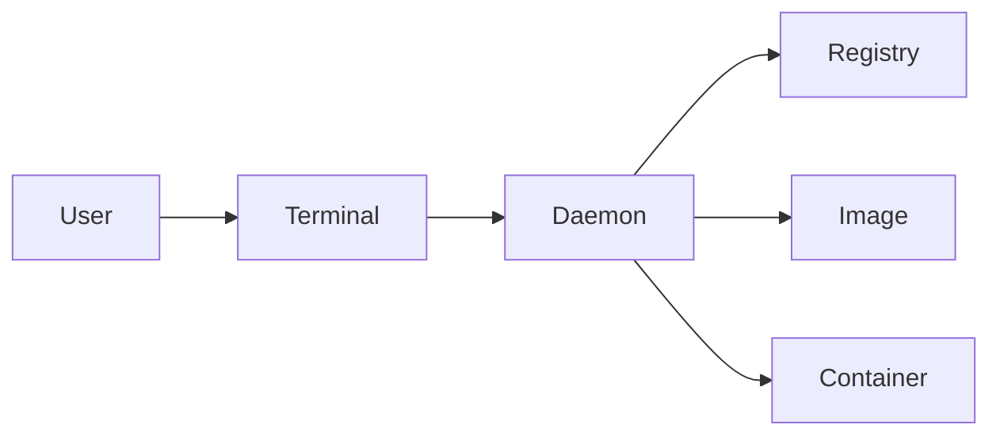

# 前提条件

- minikubeを停止する
```bash
minikube stop
```

# Hello, World!

```bash
# コンソールに"Hello, World!"が表示される
docker run hello-world
# 動作終了した"hello-world"コンテナを削除
docker container prune
```

# Dockerとは？

- Dockerとは？
  - コンテナ型仮想環境。
  - 🤔 どんな課題を解決できるの？
    - この手順、以前はうまく動いていたのに今回は動かない
      - 実行環境の冪等性確保
    - 自分の環境はうまく動くのに別の人の環境では動かない
      - ポータビリティ性の向上
    - インフラを作り直すたびに手順が変わってわからなくなる
      - 構成のコード化 
- Dockerの特徴
  - Immutable Infrastructure
    - 実行環境の冪等性確保
    - ポータビリティ性の向上
  - Infrastructure as Code (IaC)
    - 構成のコード化 

# Dockerはどのような仕組みで動いているの？

- デーモン (Daemon)
  - ホストマシンに入れられたデーモンが各種制御を行う
  - 各種制御を行うコントローラ
- イメージ (Image)
  - 実行環境のテンプレート
- レジストリ (Registry)
  - イメージの保管先
  - Docker Hubなど



# コンテナと仮想マシンの違い

- 仮想マシン
  - レイヤー
    - アプリ
    - ゲストOS (カーネル)
    - 仮想化ソフト (VMWare Workstation Player)
    - ホストOS (カーネル)
    - ハードウェア
  - **カーネルを2つ持つので、起動に時間がかかる**
  - システムとして完全な分離ができる
- コンテナ
  - レイヤー
    - アプリ
    - コンテナ (ホストOSとカーネルを共有)
    - ホストOS (カーネル)
    - ハードウェア
  - **カーネルを共有するので、起動が速い**
  - 必要な資材のみが分離できる

# イメージとコンテナ

- イメージ
  - 実行環境を定義したもの
  - Docker Hubなどのリポジトリに保管
- コンテナ
  - イメージを実行してできる実行環境
  - イメージを元に実行されている環境

- オブジェクト指向に例えると
  - イメージ=クラス
  - コンテナ=インスタンス

# Docker Hubとは？

- Docker社が提供するDockerイメージレジストリ
- 公式イメージには、「Docker Official Image」タグが付く
  - 公式イメージは、ユーザ名の指定が必須でない

- Dockerイメージレジストリは、Docker Hubだけではない
  - Amazon
    - Amazon Elastic Container Registry (ECR)
  - Google
    - Container Registry
  - Microsoft
    - Azure Container Registry
  - Docker
    - Docker Hub

:::message alert
Docker Hubでよく見る「Alpine」は、Docker向けの軽量Linuxを指す。
基本的に、DockerイメージはAlpineを選択する
:::

:::message alert
Docker Hubアカウントを作成しておく
:::

# イメージ関連のDockerコマンド

- 以下、コマンド一覧
```bash
# イメージ取得 (タグ名を省略した場合、latest)
docker image pull NAME[:TAG] 
# イメージ一覧
docker image ls
# イメージ削除 (引数はイメージID)
docker image rm IMAGE
# イメージ削除 (使われていないイメージを全削除)
docker image prune
```
- 以下、ハンズオン
```bash
# CentOS7のイメージを取得
docker image pull centos:7
# 取得できたか確認
docker image ls
# CentOS7イメージを削除
docker image rm eeb6ee3f44bd
# 削除できたか確認
docker image ls
```

## コンテナ関連のDockerコマンド

- 以下、コマンド一覧
```bash
# コンテナ実行 
#   OPTION: 
#     -d: バックグラウンド実行
#     -it: Shell実行する際に合わせて指定する
#     -e KEY=VALUE: 環境変数を与える
#     --name NAME:実行時のコンテナ名
#     -p CONTAINER:HOST: コンテナポートをホストにマッピング
#   COMMAND: 実行時に上書きしたいコマンド
docker container run [OPTION] NAME[:TAG] [COMMAND]
# コンテナ停止
docker container stop CONTAINER
# コンテナ一覧 
#  OPTION
#    -a: 停止中のコンテナも表示
docker container ls [OPTION]
# コンテナ削除
docker container rm CONTAINER
# 未使用のコンテナ削除
docker container prune
# 未使用のコンテナとイメージ削除
docker system prune
```
- 以下、ハンズオン
```bash
# 1. Nginxイメージの実行
docker container run -d nginx:alpine3.18
# 2. 実行中コンテナ一覧を表示
docker container ls
# 3.コンテナを指定して停止
docker container stop  nifty_tesla
# 4.停止中コンテナを含めた一覧の確認
docker container ls -a
# 5.不要なコンテナを削除
docker container prune
```

# Dockerコマンドの省略形

- 以下、Dockerコマンドの省略形の一覧
  - タイプ数が減って、生産性が向上するので積極的に使う
  
```bash
# イメージのビルド
docker image build
docker build
# イメージの一覧
docker image ls
docker images
# イメージの取得
docker image pull
docker pull
# イメージの削除
docker image rm
docker rmi
# コンテナの実行
docker container run
docker run
# コンテナの停止
docker container stop
docker stop
# コンテナの一覧
docker container ls
docker ps
# コンテナの削除
docker container rm
docker rm
```
# Dockerイメージを作成する

- 基本はプログラムと同じ手順
  - ソースコード作成 → ビルド → バイナリ
  - Dockerfile作成 → docker build → Dockerイメージ

## 1. Dockerfileを作成する

- Docker特有のコマンドを利用してイメージ構築手順を定義する
```dockerfile
# 元となるイメージ名を指定
FROM centos:7 
# ホストからイメージにファイルを転送
COPY docker-entrypoint.sh /var/tmp
# イメージ内でコマンドを実行(これを小さくすると、サイズも小さくできる)
RUN mv /var/tmp/docker-entrypoint.sh /usr/local/bin/; \
    chmod +x /usr/local/bin/docker-entrypoint.sh;
# デフォルト実行、初期化処理などのコマンド
ENTRYPOINT ["docker-entrypoint.sh"]
# メインとなるコマンド(Entrypointに対する引数)
CMD ["echo", "Hello World"]
```
```bash:docker-entrypoint.sh
#! /bin/sh
# 環境変数一覧を表示
env
exec "$@"
```

## 2. Dockerfileをビルドする

- 以下、Dockerfileビルドコマンド
```bash
# ビルド
#   OPTION
#     -t イメージ名を指定
#     -f Dockerfileの名前を指定する
docker build [OPTION] PATH
```
- 以下、ハンズオン
```bash
docker build -t test .
docker images
docker container prune
```

## 3. ビルドしたイメージを公開する

1. タグ名を追加
```bash
# タグ名を追加
#   ユーザ名/イメージ名:タグ
docker tag SRC_NAME[:TAG] TRG_NAME[:TAG]
```
2. Docker Hubにログイン
```bash
# Docker Hubにログイン
docker login [-u USER] [-p PASSWD]
```
3. Docker Hubにプッシュ
```bash
# Docker Hubにプッシュ
docker push IMAGE_NAME[:TAG]
```

- 以下、ハンズオン
```bash
docker build -t k5mot/test:v1.0.0 . 
docker run k5mot/test:v1.0.0
docker login
docker push k5mot/test:v1.0.0
docker stop  adoring_cannon

# Docker HubのRepositoriesを見ると、アップロードされていることがわかる
```